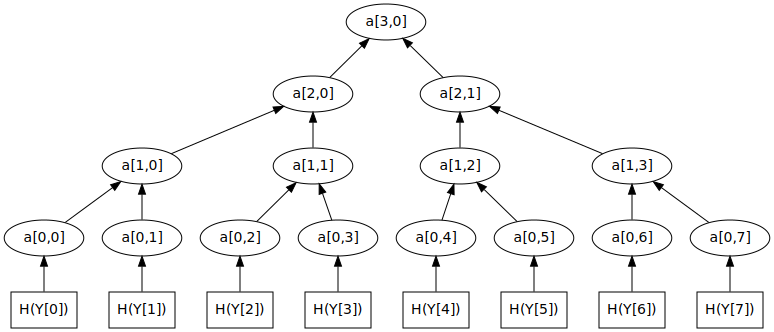

% Taproot
% Ian Shipman, Bitnomial
% February 5, 2020

# Welcome

Bitcoin & Open Blockchain is a volunteer operated organization.  Please donate what you can at

- [https://bob-chi.org/donate](https://bob-chi.org/donate)

. . .

Slides are available at

- [https://github.com/GambolingPangolin/talks/taproot](https://github.com/GambolingPangolin/talks/taproot)


# Software upgrades

We often install software and software updates without thinking about it.

. . .

::: incremental
- Via an app store (Mobile, MacOS, Windows, etc.)
- Using a standard command like `sudo apt-get upgrade`
:::

. . .

When was the last time you thought carefully about whether or not to update your software?

# Assessing an upgrade

There are many dimensions to consider if you want to be more systematic.

. . .

::: incremental
- Feature set: Will I get new features?  Will I get to keep those I use today?  How do new features interact with existing features?
- Performance: Will the software run faster, use less bandwidth, etc.?
- Usability: Will the sofware be easier to use?
- Software quality: Will the software be less buggy?
- Security: Will the software be more secure?
:::

# Consensus upgrades

Bitcoin users have to agree on some shared global state: the blockchain.  This leads to an additional upgrade assessment dimension.

. . .

::: incremental
- soft fork: non-upgraded users will accept a blockchain accepted by upgraded users
- hard fork: non-upgraded users might not accept a blockchain upgraded users consider valid
:::

. . .

Only has to do with the subset of the functionality that validates the shared state.

# Effects on decentralization

Bitcoin exists in an adversarial world and treats trust between peers as a scarce resource to conserve.

. . .

How does a proposed upgrade effect trust relationships?

. . .

Main way to think about this: how does an upgrade change the cost of running a fully validating node?

# Hard fork example

One noteworthy hard fork of Bitcoin was Bitcoin Cash, launched in August 2017

. . .

::: incremental
- Bitcoin Cash users have to run a modified version of the Bitcoin node software in order to synchronize the Bitcoin Cash UTXO set.
- Upgraded users accept blocks with much more content (in bytes) than the pre-fork limit
- Unpatched Bitcoin users reject many Bitcoin Cash blocks due to their size, among other reasons
:::

# Soft fork example

Pay to Script Hash was introduced by a soft fork in April 2012

. . .

::: incremental
- non upgraded nodes perform the validation
  * compute the hash of the top stack item
  * compare it to the hash defined in the output being spent
- upgraded nodes perform the additional validation steps
  * deserialize the top stack item as a script
  * execute against the remaining stack items
:::

. . .

Old nodes do some but not all of the validation.  If an upgraded node accepts the transaction, so will a non-upgraded node.

# BIP 2: The BIP Process

Every BIP has a _champion_ who takes it through several stages.

. . .

This can be anyone; could be you!

. . .

::: incremental
1. Float the idea wherever people are talking about Bitcoin.  See if the idea is original and if not, learn the history.
2. If the idea merits further discussion, post a draft BIP to the bitcoin-dev mailing list (following the BIP2 style guide)
3. At some point during the discussion, decide that the BIP is stable enough to submit to the BIPs repository, where Luke Dashjr will assign it a number
4.  Advocate for the idea until it makes it into Bitcoin or gets unambiguously rejected by the community.
:::

# Rolling out an upgrade

Matt Corallo recently codified the spirit of the bitcoin upgrade process into some principles

. . .

::: incremental
1. Avoid activating in the face of significant, reasonable, and directed objection.
2. Avoid activating within a timeframe which does not make high economic node-level-adoption likely.
3. Don't (needlessly) lose hashpower to un-upgraded miners.
4. Use hashpower enforcement to de-risk the upgrade process, wherever possible.
5. Follow the will of the community, irrespective of individuals or unreasoned objection, but without ever overruling any reasonable objection.
:::

# BIP 9 - Version bits with timeout and delay

::: incremental
- Activates based on miner signaling (95% during a retargeting period)
- Activation can fail
- Provides a start time and end time for signaling
:::

# BIP 8 - Version bits with lock-in by height

::: incremental
- Activates early based on miner signaling
- Cannot fail after starting
- Locks in after a "timeout" height
:::

# The new BIPs

Three of the exciting new BIPs under discussion these days are

. . .

::: incremental
- BIP 340: Schnorr signatures - a new digital signature algorithm, signature, and key encodings
- BIP 341: Taproot - a new kind of output
- BIP 342: Tapscript - a new script version with changes to script validation rules
:::

# BIP 340: Schnorr signatures 1

Schnorr signature scheme

```
P = public key
m = message digest
R = random nonce
signature: (R,s) where s * G = H(R|P|m)P + R
```

. . .

::: incremental
- Digital signatures are the basis of coin ownership
- Current algorithm ECDSA chosen over Schnorr due to a patent
- BIP 340 is totally general and might be a useful standard outside bitcoin
:::

# BIP 340: Schnorr signatures 2

Security model

::: incremental
- Schnorr security provably reduces to the security of the discrete log problem
- Easier to analyze protocols built using Schnorr
- ECDSA has empirical security
:::

# BIP 340: Schnorr signatures 3

Schnorr signatures can be batch verified (ECDSA cannot)

. . .

Batch verification = checking many signatures faster together than one at a time

. . .

```
Keys       = P_1, ..., P_n
Messages   = m_1, ..., m_n
Signatures = (R_1, s_1), ..., (R_n, s_n)

Randomly sample x_1, ..., x_n
Compute:
  s   := x_1 * s_1 + ... + x_n * s_n
  e_i := H(R_i|P_i|m_i) * P_i
  E   := x_1 * e_1 + ...  + x_n * e_n
  R   := x_1 * R_1 + ... + x_n * R_n

Test: s * G == E + R
```

# BIP 340: Schnorr signatures 4

Applications

::: incremental
- `MuSig` - where N parties combine pubkeys to produce a group key and interactively build signatures for it
  * improved privacy for e.g. lightning channels
- Adaptor signatures - where publishing a signature reveals a secret
  * scriptless atomic swaps
  * certain upgrades to lightning payment routing
:::

# BIP 341: Taproot 1

Structure of a taproot output

. . .

::: incremental
- A taproot output has an associated "output key" `Q`
- Outputs `scriptPubKey` = `"01 Q"`
- There is also a commitment `m` to a set of output scripts and "internal key" `P`
- The taproot "internal key" `P` satisifies `H(P|m)*G + P = Q`
- Public keys use a 32 byte encoding
:::

# BIP 341: Taproot 2


Taproot provides two spending pathways

. . .

Output key `Q`, internal key `P`

`H(P|script_commitment) * G + P = Q`

::: incremental
- Spend with a `Q` signature
- Spend by proving a script `s` is in the script set and passing evaluation
:::

# BIP 341: Taproot 3

The taproot BIP introduces merklized abstract syntax trees (MAST)



# BIP 341: Taproot 4

Spender(s) decide on a set of scripts and arrange them into a merkle tree.  The output commits to the root of this tree, and spending a leaf requires a proof of inclusion.

. . .

::: incremental
- tree does not need to be balanced, more likely-to-be-spent scripts can occur closer to the root
- proposal uses a canoncial encoding where at each node, we sort the child hashes lexicographically before hashing the pair
:::


# BIP 341: Taproot 5

Taproot advantages

. . .

::: incremental
- fungibility - taproot outputs look like pay to pubkey unless spent by a script branch
- script privacy - spends only reveal the script branch that is actually used
:::

# BIP 342: Tapscript 1

This BIP covers some changes to the meanings of scripts that appear in taproot script spends

. . .

::: incremental
- redefine `OP_CHECKSIG` and cousins to use Schnorr verification
- replace `OP_CHECKMULTISIG` with `OP_CHECKSIGADD` (to support batch verifiable multisig)
- `OP_SUCCESS` upgrade mechanism
:::

# BIP 342: Tapscript 2

`OP_SUCCESS` opcodes

. . .

::: incremental
- repurpose opcodes numbered 80, 98, 126-129, 131-134, 137-138, 141-142, 149-153, 187-254
- if a tapscript contains any of these opcodes, validation automatically suceeds
- compared with the no-op upgrade path, removes the need to support two different interpretations for the same script
:::

# Upgrade assessment

::: incremental
- Feature set: get new output type and a more powerful signing algorithm, lose no existing features
- Performance: big win with batch verification
- Usability: you decide ...
- Software quality: significant complexity increase with the corresponding potential for bugs
- Security: Schnorr signatures have clearer security and compose better than ECDSA
- Fork type: soft fork
- Effect on decentralization: probably an improvement due to bandwidth savings and more efficient signature validation
:::

# Thanks for your time!

Where to go for further discussion

- `#bitcoin-dev` on Freenode
- bitcoin-dev mailing list
